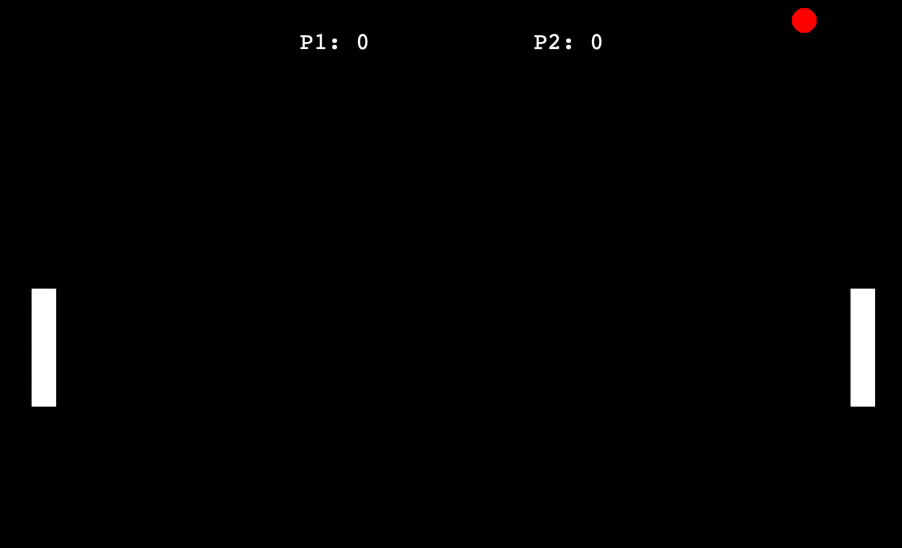

# Pong game 

  <h2>
    
  </h2>

### This is a simple pong game made with python and turtle module.

# Screenshot

## Controls
- W - move up (1 player)
- S - move down (1 player)
- up arrow - move up (2 player)
- down arrow - move down (2 player)
- space - pause (not yet implemented)
- q - quit (not yet implemented)

## TODOs

- [x] add pause
- [x] add quit

## How to run

- clone the repo
- run the main.py file
- enjoy!

